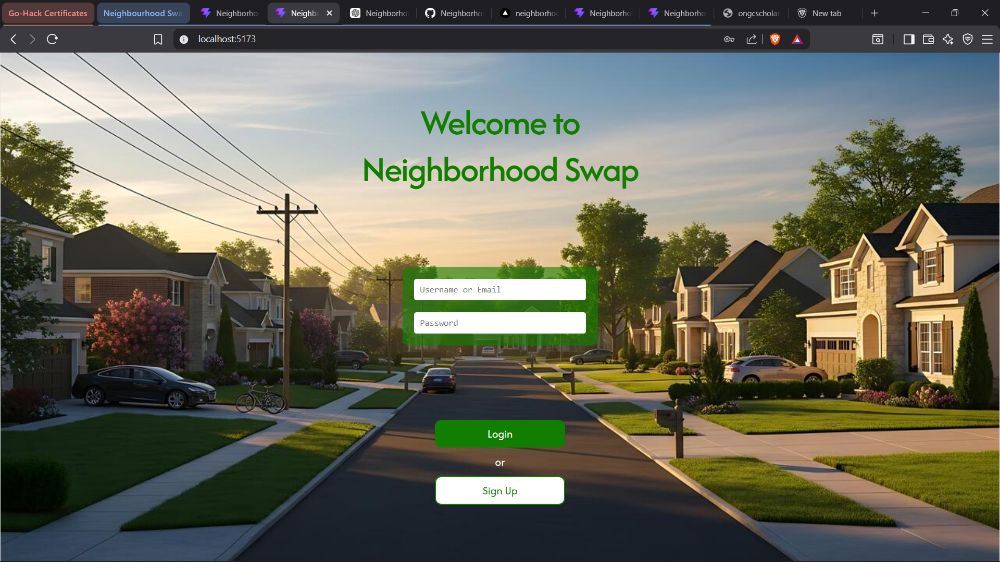
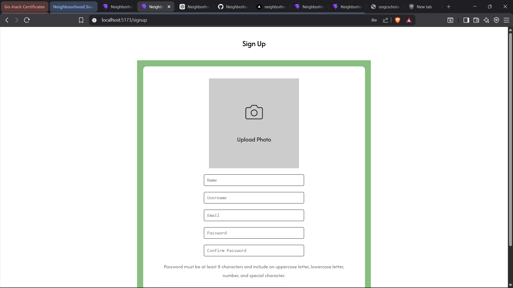
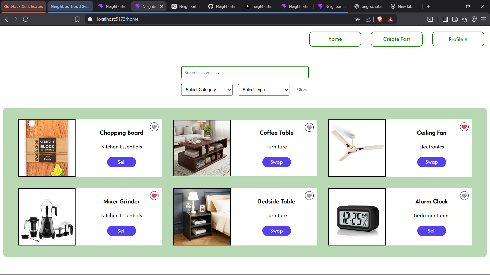
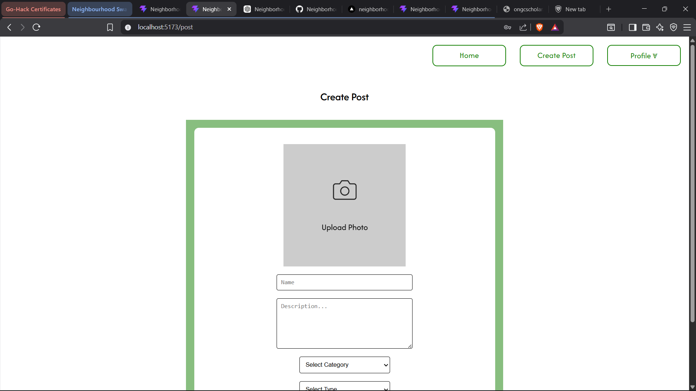
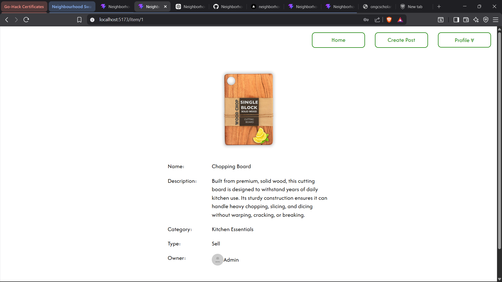
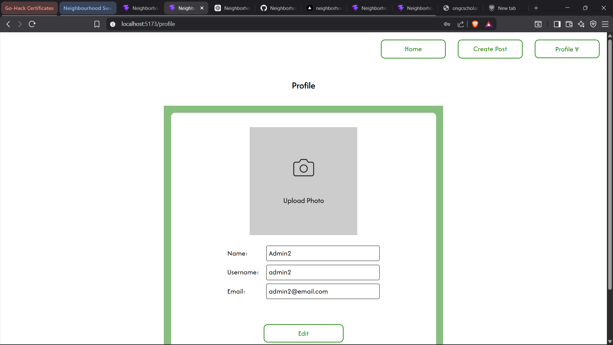
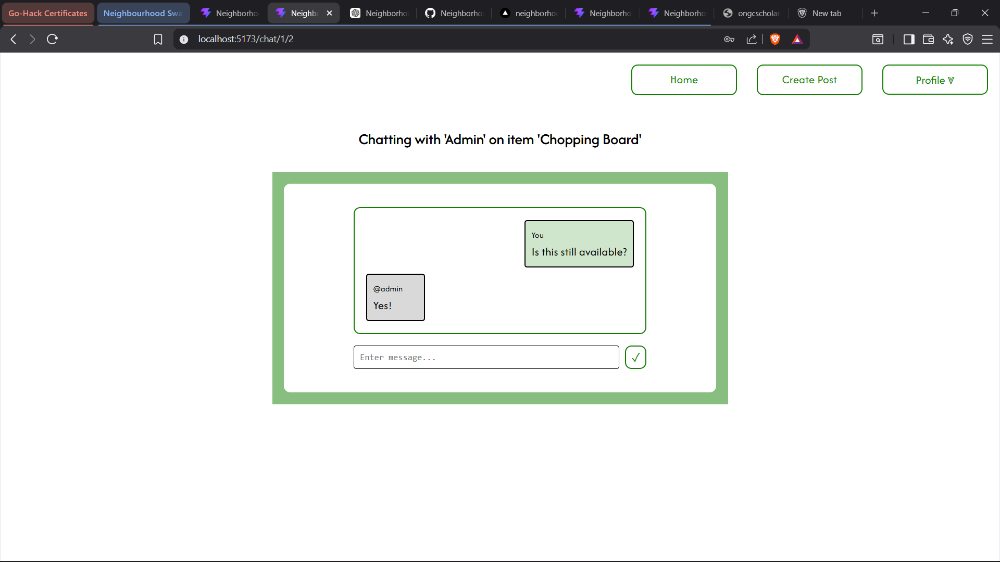
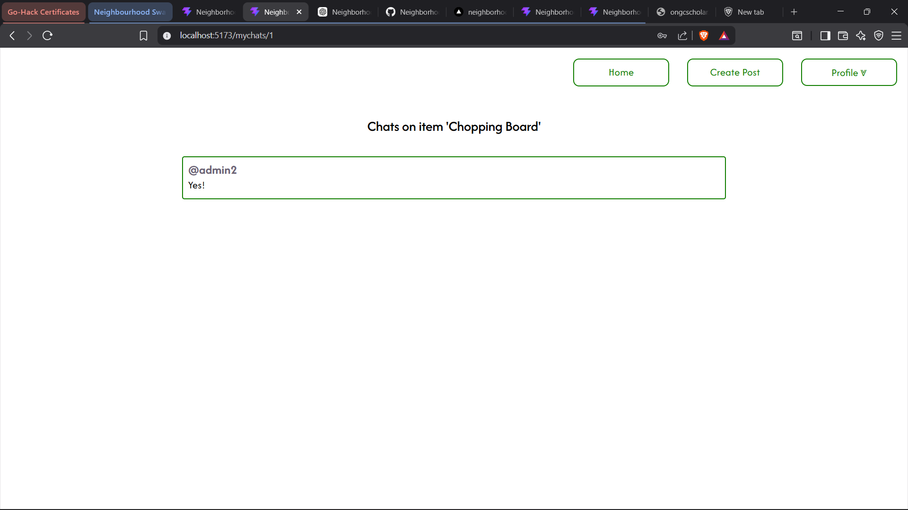

# Neighborhood-Swap

## Overview

Neighborhood Swap is a React + Vite marketplace prototype for local item swapping, built with client-side state and in-memory data. Users can sign up, log in, create and manage item listings, favorite items, and chat directly with buyers or sellers.

## Key Features

- Authentication flow
  - Login by username or email
  - Sign up with validation for password strength and duplicate usernames/emails
- User profile management
  - Edit profile name, username, email, and profile image
  - Delete account and remove owned listings
- Item management
  - Create new item posts with image upload, category, and type
  - View item details
  - Edit or delete owned item listings
- Marketplace browsing
  - Home feed showing all available items
  - My Posts page for the current user's listings
  - Favourites page for saved items
- Chat support
  - Buyer-to-seller conversations per item
  - Seller chat dashboard for item-specific conversations
  - Message history with automatic scroll to latest message

## App Pages / Routes

- `/` - Onboard login page
- `/signup` - Registration page
- `/home` - Marketplace feed
- `/post` - Create a new item post
- `/item/:id` - Item detail and conversation launcher
- `/profile` - User profile editor
- `/myposts` - Current user's posted items
- `/favourites` - Favorite items list
- `/chat/:itemId/:buyerId` - One-to-one chat for an item
- `/mychats/:itemId` - Seller view of chats for a listed item

## Architecture

- React 19 with Vite for fast development
- `react-router-dom` for routing
- Context providers:
  - `ItemContext` for item list and CRUD operations
  - `UserContext` for user list, current user, favorites, and profile updates
  - `ChatContext` for chat creation and messaging
- Data is initialized from local seed files in `src/data/`
- State is stored in memory and does not persist after refresh

## Folder Structure

- `src/components/` - reusable UI and layout components
- `src/context/` - React context providers and hooks
- `src/pages/` - route pages and feature screens
- `src/css/` - page-level styling
- `src/data/` - seed items, users, chats, categories, and types

## Getting Started

Install dependencies:

```bash
npm install
```

Run the development server:

```bash
npm run dev
```

Build for production:

```bash
npm run build
```

Preview the production build:

```bash
npm run preview
```

## Notes

- Image uploads use browser object URLs and are only available during the current session.
- The app uses in-memory state only; refreshing the browser resets all runtime changes.
- User authentication is implemented locally in the browser and is not secure for production use.

## Tech Stack

- React 19
- Vite
- react-router-dom
- ESLint

---

Enjoy exploring Neighborhood Swap!

## Screenshots

### Login screen


### Sign up screen


### Home screen


### Create Post screen


### Item screen


### Profile screen


### Chat screen


### MyChats screen
